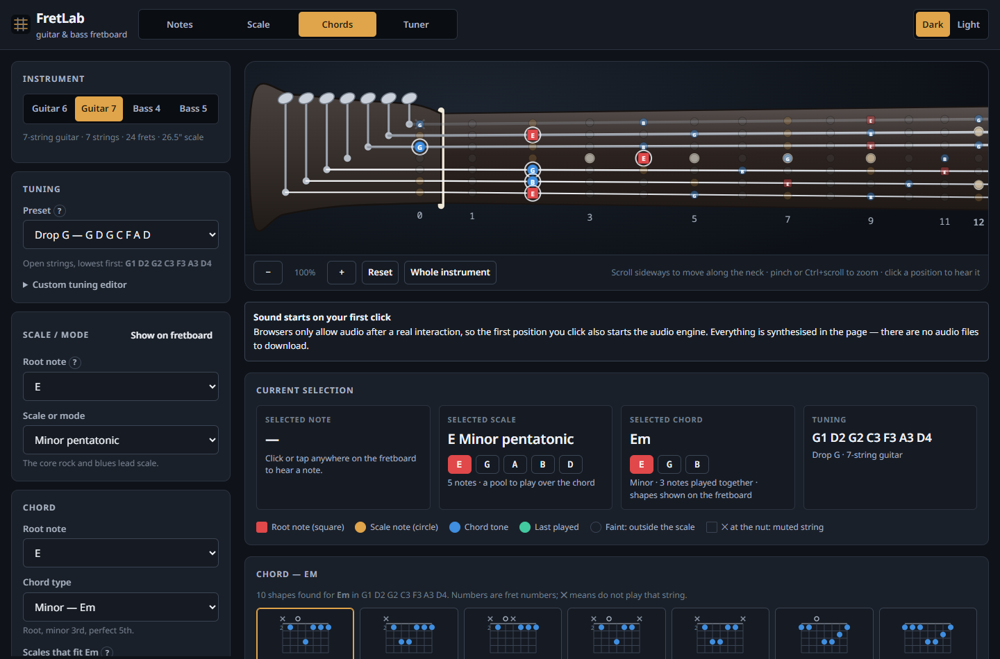
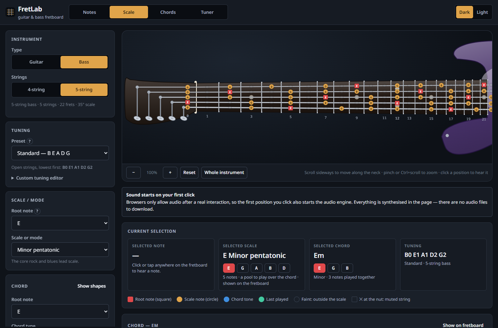

# 1. Summary

FretLab is a complete, working web application for guitar and bass learners. It
is not a prototype: every button described below does the thing it says, and the
project is ready to run locally and to deploy to free hosting without buying a
domain.

| | |
| --- | --- |
| **Stack** | React 18, TypeScript 5.6, Vite 5, Zustand 4 |
| **Instruments** | 6- and 7-string guitar, 4- and 5-string bass |
| **Tunings** | 32 presets plus a custom tuning editor per instrument |
| **Scales** | 27 scales and modes |
| **Chords** | 21 chord types, including two kinds of power chord |
| **Audio** | Karplus–Strong plucked-string synthesis, Web Audio API, no samples |
| **Tuner** | Microphone pitch detection, accurate to about one cent |
| **Tests** | 170, all passing |
| **Production bundle** | 236 kB JavaScript (76 kB gzipped), 16 kB CSS |
| **Deployment** | GitHub Pages workflow included; Cloudflare, Netlify, Vercel configs included |
| **Cost to run** | Nothing. No backend, no account, no domain. |

The single design decision that the rest of the project follows from: **the
music-theory engine owns all musical truth, and it is derived from the current
tuning every time.** There is no stored table of fret positions and no stored
table of chord shapes anywhere in the codebase. That is what makes alternate
tunings correct rather than approximately correct.


---

# 2. What was built

## 2.0 Revisions

### Revision 3

- **The instrument graphics are now built from supplied layered SVG drawings**
  of a Stratocaster-style guitar and a Precision-Bass-style bass, a file per
  part. `tools/extract-artwork.mjs` reassembles the parts into one coordinate
  system by matching shape sizes, fits the equal-tempered fret rule to the
  drawings' own fret lines to recover the nut and scale length (to better than
  one part in a thousand), and re-expresses everything with the nut at the
  origin and the scale length at 1000 units — so FretLab's computed notes land
  on the drawn frets. See `reference/README.md`.
- **Pitch detection was wrong on most strings**, which is what made the tuner's
  meter look as though it worked only for the lowest string. Three independent
  faults, all fixed and covered by a test over every open string of every
  tuning preset: an anti-alias filter whose corner sat near 290 Hz; a
  decimation factor derived from the search range alone, which left a bass's
  period only fifteen samples long; and a peak search that stepped over the
  true period on strongly periodic signals. 38 failures became none.
- **Pinning a string in the tuner is now obvious and reversible**, and when a
  different string is played against a pinned target the readout says so
  instead of leaving the needle pegged at one end.
- **The 7-string guitar and 5-string bass were removed.**
- **A reference-pitch setting** (A4, 392-466 Hz) retunes playback, the tuner's
  targets and every displayed frequency.
- The scale and chord choosers appear only in their own modes; fret numbers
  appear only on frets that carry position markers.

### Revision 2

After the first build was reviewed, six changes were made:

1. **The body and headstock outlines were redrawn.** They are now traced
   outlines of an offset double-cutaway guitar and an offset bass — real horns,
   cutaway scoops, a pinched waist and bouts — rather than the smooth profiles
   of the first version, which read as featureless blobs.
2. **The instrument was turned the right way up**: the lowest-pitched string is
   now drawn at the bottom, as a chord chart or tab staff reads, and the body
   and headstock were re-authored to match.
3. **The fret wires became visible.** They were being painted with an SVG
   gradient in `objectBoundingBox` units; a perfectly vertical line has zero
   bounding-box width, so the gradient degenerated and nothing was drawn. They
   are now solid metal with a bright crown.
4. **Clicking the selected position now deselects it.**
5. **The missing middle string was fixed** — the same gradient fault. A
   perfectly horizontal line has zero bounding-box height, and only the exact
   middle string of an odd-numbered set is perfectly horizontal, which is why it
   was the 4th string of 7 and the 3rd of 5 that vanished. One fix covered both
   this and the frets.
6. **The instrument selector became two steps**: Guitar or Bass, then the
   string count, with the instrument last used in each family remembered.

## 2.1 The instrument view

The instrument is drawn as a single SVG in one coordinate system: headstock,
nut, fretboard, body, hardware and strings. The body and headstock are traced
outlines held as data, so the silhouette can be adjusted without touching any
rendering code. The lowest-pitched string is drawn at the bottom. The strings are drawn as one
continuous run from each tuning peg, over the nut, to the bridge, which is what
makes the fretboard and the instrument graphic read as one object rather than
two unrelated pictures. Fret spacing uses the real equal-tempered rule
(`1 − 2^(−fret/12)`), so the neck narrows the way a neck does and the 12th fret
falls exactly halfway to the bridge.

The view scrolls horizontally, zooms with buttons, with pinch gestures on a
touch screen and with Ctrl+scroll, and has a "Whole instrument" control that
zooms out to show the complete guitar or bass including the body.


All of the artwork is generated by the project's own code from profile data in
`components/fretboard/geometry.ts`. No commercial or copyrighted instrument
imagery, samples or brand marks are used anywhere.

## 2.2 The four interaction modes

**Notes** — every position is clickable and plays the pitch it actually
produces.

**Scale** — the selected scale is highlighted across the whole neck, with note
names (or scale degrees) printed on each marker and the root distinguished.

**Chords** — calculated chord shapes, with playback and strumming.

**Tuner** — the view travels to the headstock and a chromatic tuner appears
integrated with the tuning machines.

## 2.3 Clicking a position

Clicking or tapping anywhere in a fret space determines the note from the
instrument, the string, the fret and the current tuning; displays its name,
octave, frequency and MIDI number; and plays it. The hit area is the whole fret
space rather than the dot, so it stays usable with a fingertip.

---

# 3. Architecture

The organising rule: **the music-theory engine knows nothing about React, and
the user interface never does arithmetic on note names.**

```
src/
  core/                    pure TypeScript, no React, no DOM, unit-tested
    theory/pitch.ts        note names <-> MIDI <-> frequency <-> cents
    theory/spelling.ts     systematic enharmonic spelling
    theory/scales.ts       scale catalogue and pitch-class sets
    theory/chords.ts       chord catalogue and chord-to-scale relations
    theory/fretboard.ts    string + fret + tuning -> pitch
    theory/voicing.ts      tuning + chord -> playable fret shapes
    instruments/           instruments and tunings as data
    audio/pluck.ts         offline Karplus-Strong string synthesis
    audio/AudioEngine.ts   Web Audio graph, caching, strum scheduling
    tuner/pitchDetect.ts   NSDF pitch detection
    tuner/analysis.ts      frequency -> note, cents, target string
    tuner/TunerEngine.ts   microphone capture and the analysis loop

  state/store.ts           settings only, persisted to localStorage
  state/selectors.ts       settings -> derived musical context

  components/fretboard/    geometry, the instrument SVG, the stage/camera
  components/panels/       control, information, chord and tuner panels
  components/ui/           accessible form primitives
  hooks/                   React bindings for the engines
  tests/                   170 tests
```

## 3.1 State versus derived data

The store holds only *choices*: `"guitar6"`, `"drop-d"`, `"E"`,
`"minor-pentatonic"`, a volume, a theme. Note names, highlighted positions and
chord shapes are **derived** on demand in `selectors.ts` and memoised.

This matters more than it sounds. Because there is no second copy of the musical
truth, it is not possible for the fretboard labels to disagree with the chord
shapes, or for playback to disagree with the tuner. Changing one tuning preset
necessarily updates all of them, because they are all computed from the same
function's result.

## 3.2 Data-driven instruments

Adding an instrument means adding one object to `INSTRUMENTS`: name, family,
string count, fret count, tuning presets, string gauges, scale length and a body
style. Nothing in the renderer, the engines or the panels branches on instrument
identity. An 8-string guitar, a 6-string bass or a ukulele would need no new
rendering or engine code.

## 3.3 Rendering performance

The instrument is one SVG; each position is a memoised component. Playing a note
re-renders one marker, not the neck. Scrolling and zooming are native scrolling
and CSS transforms rather than React state churn, and the chord search — the one
genuinely expensive derivation — is cached by tuning, root and chord.

---

# 4. The music-theory engine

## 4.1 Pitch is an integer

Everything internal is a MIDI note number: C4 = 60, A4 = 69. Note *names* exist
only at the edge, for display, and are always derived. No part of the
application manipulates note names as strings.

| Function | Meaning |
| --- | --- |
| `noteNameToMidi("E2")` → `40` | name → pitch |
| `midiToNote(40)` → `E2` | pitch → name |
| `midiToFreq(40)` → `82.41 Hz` | pitch → frequency |
| `freqToNearestNote(438)` → `A4, −7.9 cents` | frequency → pitch and deviation |
| `midiAt(openMidis, string, fret)` | string + fret + tuning → pitch |
| `scalePitchClasses(root, scale)` | scale + root → pitch-class set |
| `chordPitchClasses(root, chord)` | chord + root → pitch-class set |
| `findVoicings(openMidis, root, chord)` | tuning + chord → playable shapes |

## 4.2 The fretboard

A fret position is `openStringMidi + fretNumber`. That is the whole model. There
is no table of fret positions, so there is nothing that could be right for
standard tuning and wrong for anything else.

Scale highlighting works on **pitch class**: a position lights up when its pitch
class belongs to the scale's set. It is never a standard-tuning pattern copied
around. In Drop D, the lowest string's highlighted frets for E minor pentatonic
become `0 2 5 7 9 12` instead of `0 3 5 7 10 12`, because the open string is now
D — and the engine simply computes that rather than being told.

## 4.3 Enharmonic spelling, systematically

Spelling is the part of a fretboard application that usually degenerates into a
list of exceptions. Here it is one rule.

Every scale and chord carries two parallel arrays: chromatic `intervals`
(semitones from the root) and generic `degrees` (which letter the note is
written on). The degree fixes the letter; the semitone count then fixes the
accidental. That is exactly how notation works, and from it, with no special
cases anywhere:

- B♭ major spells **Bb C D Eb F G A** — never A♯ C D D♯ F G A.
- F♯ major spells **F# G# A# B C# D# E#**, including the E♯ that beginners'
  tools get wrong.
- The A blues scale spells **A C D Eb E G**, with the ♭5 and the ♮5 written on
  the same letter, as the scale actually is.
- C diminished 7th spells **C Eb Gb Bbb**, with the double flat.

Notes outside the current key fall back to the key's own accidental side, so a
fretboard in E♭ minor never shows a stray A♯ next to a B♭. Choosing a root of
`Bb` rather than `A#` in the controls is how the player selects the key's
spelling — the preference the brief asked for, implemented as a rule rather than
as a list.

## 4.4 Chords and scales kept distinct

The brief was explicit that a learner must not confuse a chord voicing with a
scale, and the interface is built around that. They are separate panels with
separate note lists and separate explanations ("3 notes played together" versus
"a pool to play over the chord"). The chord panel then lists the scales that fit
the selected chord, each with a one-line reason, and **every suggestion is
verified to contain every chord tone before it is offered** — so a dominant 7th
is never paired with a plain major scale, which does not contain its flat 7th.
Clicking a suggestion switches the fretboard to that scale and says so.

---

# 5. Alternate tunings and the chord engine

This was the most important correctness requirement in the brief, and it is
where the project puts most of its effort.

## 5.1 There are no stored chord shapes

`findVoicings()` searches the fretboard. For each hand position along the neck
it enumerates, per string, the frets whose **actual sounding pitch class**
belongs to the chord, plus the open string and "muted". It prunes anything
needing more than four fingers or a stretch wider than four frets, requires
every non-optional chord tone to be present and the root to sound, then scores
the survivors for playability: root in the bass, fewer fingers, lower on the
neck, fuller voicing, no awkward dead strings in the middle.

The consequences are all verified by tests:

- **In standard tuning the search rediscovers the shapes players already know.**
  The open C (`x32010`), E minor (`022000`), A minor (`x02210`), D (`xx0232`),
  G (`320003`), E7 (`020100`), A7 (`x02020`), Cmaj7 (`x32000`) and Am7
  (`x02010`) all come out of the solver. None of them was typed in.
- **In D standard it does not offer `022000` as E minor.** In that tuning those
  frets sound a D minor chord, so the solver offers that shape under D minor,
  where it belongs. A familiar shape is never mislabelled as a chord it does not
  produce.
- **If a chord genuinely cannot be fingered in the current tuning**, the panel
  says so in plain language instead of showing something that would sound like a
  different chord.

Every shape is displayed together with the notes it actually sounds, computed
from the live tuning, and with any chord tone it had to omit.


## 5.2 Power chords

Power chords are generated separately, because they are what most guitarists
actually use alternate tunings for. The fifth and the octave are located **by
pitch**, not by a fret offset. One piece of code therefore produces:

- the familiar two-fret offset in standard tuning;
- a **three-fret** offset when the root sits on the G string, because the
  interval to the B string is a major third rather than a fourth — the case
  hard-coded shape tables get wrong;
- the **one-finger, flat shape** in Drop D, where all three strings land on the
  same fret;
- correct shapes on the 7-string guitar in Drop G and on both basses.

A test asserts that across seven instrument-and-tuning combinations and five
roots, every generated power chord sounds exactly a root and a fifth (plus an
octave when asked), with the root in the bass.



## 5.3 Custom tunings

Each instrument keeps its own custom tuning. The editor validates every string
as it is typed, names the offending string when it is wrong, and refuses to
apply an invalid tuning rather than letting it reach the fretboard. There are
also one-click transpose-everything-by-a-semitone buttons.



---

# 6. The audio engine

Notes are **synthesised, not sampled**: there are no audio files to download and
no licensing questions.

## 6.1 Why Karplus–Strong, and why rendered offline

The model is Karplus–Strong: a short burst of filtered noise circulates in a
delay line one period long, losing a little energy and a little treble on every
lap — which is what a plucked string does. A pick-position comb filter shapes
the excitation, so the attack has the hollow character of a pluck rather than a
uniform hiss.

The obvious implementation — a `DelayNode` in a Web Audio feedback loop — does
not work. A delay inside a cycle is quantised to a 128-sample block, which caps
usable pitch at roughly 344 Hz and detunes everything above it. So each note is
instead rendered **offline into a sample buffer** in JavaScript, with a
fractional delay line implemented by linear interpolation between two taps, and
the loop filter's half-sample of delay accounted for explicitly.

The result is measurably in tune. A test renders every open string and a range
of fretted notes and measures the fundamental of the rendered audio by
autocorrelation: **every note is within 5 cents**, from a 5-string bass's low B
to the 24th fret of a guitar's top E, at 44.1, 48 and 96 kHz.

Each note then passes a short EQ chain standing in for the instrument body —
different for guitar and for bass — and a limiter, so a six-string strum does not
clip. Buffers are cached per pitch, so repeated notes cost nothing.

## 6.2 Strumming

A chord is scheduled on the audio clock against a **single** reading of
`currentTime`, so the sweep is exactly even; reading the clock once per note
lets real elapsed time creep in and makes the strum uneven. Measured in a real
browser, a six-string down strum at the normal preset schedules its strings at
0, 32, 64, 96, 128 and 160 ms.

- **Together** plays the strings with only a few milliseconds of humanising
  spread.
- **Down** runs from the lowest-pitched string upward.
- **Up** runs from the highest-pitched string downward.
- **Muted strings are skipped entirely** and make no sound.
- Speed is Slow (70 ms), Normal (32 ms), Fast (12 ms) or any custom value.

Thin strings are rendered brighter than thick ones, which is part of why a down
strum and an up strum sound genuinely different rather than merely reversed.

---

# 7. The tuner

## 7.1 Signal path

1. **Capture.** `getUserMedia` is called **only** when tuner mode is entered,
   with echo cancellation, noise suppression and automatic gain control
   explicitly off — all three distort a sustained musical tone enough to move
   its detected pitch. Frames of 8192 samples (about 170 ms at 48 kHz) are read
   from an `AnalyserNode`, long enough to contain several periods of a 31 Hz low
   B.

2. **Detection.** The McLeod normalised square difference function, the
   normalised cousin of autocorrelation, is evaluated and the **first** strong
   peak is taken rather than the tallest. This is the detail that matters: a
   periodic signal correlates just as well at twice its period, and "tallest
   wins" is precisely what makes cheap tuners read an octave low on a bass
   string. The work is done in two stages — a decimated pass behind a four-pole
   anti-aliasing filter to find the period cheaply, then a refinement at the full
   sample rate with parabolic interpolation, which brings the estimate to about
   a cent. A median filter over the last five frames stops the needle twitching.

3. **Interpretation.** The frequency becomes a reading: the nearest chromatic
   note, and the cents deviation from the nearest string of **the tuning
   currently selected**. Drop C, E♭ standard and fully custom tunings therefore
   work with no special case. A string can be pinned instead of auto-selected,
   and clicking a string also plays its reference pitch.

4. **Display.** Note name, exact detected frequency, target frequency, signed
   cents, a needle, and the verdict written out in words — "Flat by 9 cents —
   tighten the string" — so nothing depends on colour alone. ±5 cents counts as
   in tune.

## 7.2 Measured accuracy

The tuner was verified end to end in a real browser by feeding the application a
synthesised guitar note as its microphone input, so everything downstream of the
operating system's audio driver is the application's real code.

| Input | Expected | Reported by the application |
| --- | --- | --- |
| Open low E, in tune | E2, 0 cents | E2, +0.0 cents, "In tune" |
| Low E, slightly flat | E2, −8.6 cents | E2, −9 cents, "Flat — tighten the string" |
| A string, sharp | A2, +23.5 cents | A2, +23.4 cents, "Sharp — loosen the string" |
| D string | D3, +2.0 cents | D3, +2.0 cents, "In tune" |
| Drop D low string | D2, −9.8 cents | D2, −9.8 cents, target shown as D2, not E2 |
| 5-string bass low B | B0, +7.4 cents | B0, +7.4 cents, at 31 Hz |

Every case identified the right note and the right target string, with cents
deviation accurate to within half a cent.

## 7.3 The camera move

Entering tuner mode does not open a popup somewhere on the screen. The current
zoom level and horizontal scroll position are **stored**, then one CSS transform
translates and scales the entire instrument so the headstock ends up enlarged
and framed, with the tuner readout beside it and the tuning pegs lighting up as
a string comes into tune. The stage itself grows to make room. The scale is
clamped by both the width and the height of the view, so the headstock is never
cropped.

Leaving tuner mode animates back along the same path and then restores the
**stored** zoom and scroll position — not an arbitrary default. The transition
honours `prefers-reduced-motion`.


---

# 8. Interface, accessibility and resilience

## 8.1 Visual design

Noto Sans throughout (verified as actually loading, with a system-font fallback
stack for when Google Fonts is unreachable), a restrained dark and light theme,
and the fretboard kept as the clear visual focus. Musical roles are distinguished
by **shape as well as colour** — roots are squares, scale notes are circles,
chord-shape notes carry a halo, muted strings carry an ✕ at the nut — so the
display survives greyscale and colour-blindness.


## 8.2 Responsive design

The layout moves to a single column below 1080 px, with the instrument placed
first because it is the point of the page. The fretboard stays horizontally
scrollable, pinch-to-zoom works, and controls keep a 42 px minimum touch target.

{width=2.4in}

## 8.3 Accessibility

- The fretboard is a keyboard-navigable grid: arrow keys move, Home and End jump
  to the nut and the last fret, Enter or Space plays, and the current position is
  announced.
- Every control has a real accessible name. One bug found this way during
  development — a toggle switch whose `aria-labelledby` pointed at an id
  containing spaces, so it never resolved and the switch was effectively unnamed
  — was caught by a test asserting that every control is named, and fixed.
- The tuner meter exposes its reading through `role="meter"` and live regions.
- Visible focus rings, a skip link, help text on unfamiliar controls, and text
  contrast meeting WCAG AA in both themes.

## 8.4 Error handling

Every failure path produces a clear message rather than a broken page: Web Audio
missing, audio initialisation failing, microphone permission denied, no
microphone present, an insecure (non-HTTPS) context, an unsupported browser, an
invalid custom tuning, a chord with no playable voicing in the current tuning,
and `localStorage` being blocked. A React error boundary catches any remaining
rendering failure and offers to clear the saved settings, which is the most
likely way a stored value could break a future version.

## 8.5 Settings that persist

Instrument, tuning (including custom tunings per instrument), scale and root,
chord and root, volume, zoom, label preferences, theme, strum direction and
speed — all in `localStorage`, with no account and no backend. Tuner mode is
deliberately *not* persisted, so reloading never reopens the microphone.

---

# 9. Testing results

`npm test` — **170 tests, 8 files, all passing** in about 12 seconds.

| Area | Tests | What is checked |
| --- | --- | --- |
| Pitch | 14 | name ↔ MIDI round trip over the whole range; frequencies against published values; cents; nearest-note boundaries; malformed names rejected |
| Spelling | 10 | B♭ major; F♯ major with its E♯; modal spellings; the blues ♭5/♮5 on one letter; C°7's double flat; key-aware fretboard maps |
| Fretboard | 24 | every tuning preset of all four instruments; Drop D changing only one string; D standard shifting all six; custom tunings; highlighting moving with the tuning; tuning validation |
| Scales | 13 | relative modes sharing one pitch-class set; harmonic vs melodic minor; pentatonics; blues; symmetric scales; degree labels |
| Chords | 20 | every chord type's pitch classes; the solver finding real open shapes; **every returned shape verified to sound only the chord it claims**; shapes recalculated per tuning; power chords across seven instrument/tuning combinations |
| Audio | 13 | rendered notes in tune within 5 cents across both instruments' ranges and three sample rates; harmonic content; decay; determinism |
| Tuner | 23 | every open string of every standard tuning; a 31 Hz low B; no octave errors; silence and noise rejected; cents; targets following the current tuning |
| Application | 40 | all four instruments; tuning changes recalculating the rendered neck; the custom-tuning editor; chord shapes per tuning; the Drop D one-finger power chord; down vs up strum ordering; muted strings silent; strum speed; microphone requested only in tuner mode and released on exit; view saved and restored; persistence; keyboard navigation |

The application tests render the real application in jsdom and drive it the way
a visitor would, rather than testing a stub.

## 9.1 Checks run in a real browser

Three scripts in `tools/` drive the built application in Chrome. They confirmed:

- **No console errors or warnings** in any mode, instrument, theme or viewport.
- **Noto Sans genuinely loading** (`document.fonts.check` returns true).
- **Real audio**: clicking a fret produces a 3.3-second buffer with a peak
  amplitude of 0.92 — actual audio, not silence.
- **Strum direction**: a down strum schedules six sources at an even 32 ms
  apart; an up strum schedules the identical set in exactly reversed order.
- **The tuner camera** transform applying on entry and clearing on exit.
- **The tuner readings** in section 7.2.

## 9.2 Items from the brief's development checklist

| Check | Result |
| --- | --- |
| Build the application | Passes; `tsc --noEmit` clean |
| Run locally | `npm run dev`, verified |
| Fix build and console errors | No build errors, no console errors |
| Tuning changes recalculate fret notes | Verified by unit and UI tests |
| All four instrument configurations | Verified, each separately |
| 7-string guitar separately | Verified, including Drop G |
| 5-string bass separately | Verified, including the 31 Hz low B |
| Scale highlighting | Verified |
| Note playback | Verified in a real browser |
| Chord playback | Verified in a real browser |
| Normal / down / up strumming | Verified, with measured timing |
| Tuner mode and its animation | Verified, with measured transforms |
| Exiting the tuner restores the previous view | Verified by test and in the browser |
| Mobile responsiveness | Verified at 390 × 844 |
| Noto Sans actually in use | Verified in the browser |
| Production build works | Verified via `npm run preview` |

---

# 10. Running and deploying

## 10.1 Locally

```bash
npm install
npm run dev        # http://localhost:5173
npm test
npm run build      # type-checks, then writes dist/
npm run preview    # serves dist/ at http://localhost:4173
```

Node 18 or newer; 20 LTS recommended. `http://localhost` counts as a secure
context, so the microphone tuner works in development with no certificate setup.

## 10.2 Free hosting, no domain required

The build sets `base: './'`, so the same `dist/` folder works from a site root
*or* from a subdirectory. Nothing needs reconfiguring per host.

**GitHub Pages is the recommended option and is already wired up.**
`.github/workflows/deploy.yml` installs, runs the tests, builds and publishes on
every push to `main`. The only manual step is choosing **GitHub Actions** under
Settings → Pages. The site then appears at
`https://<username>.github.io/<repository>/`, over HTTPS, which is what the
microphone tuner needs.

`netlify.toml` and `vercel.json` are included for those platforms, and
Cloudflare Pages needs only `npm run build` with an output directory of `dist`.
Netlify also accepts the `dist/` folder by drag and drop with no build step at
all.

## 10.3 Microphone permission

Permission is requested only on entering tuner mode — loading the page never
prompts. Audio is analysed in the page and discarded frame by frame; nothing is
recorded or transmitted. Leaving tuner mode stops the media tracks, so the
browser's recording indicator goes out. The README documents how to re-enable a
denied microphone in each major browser.

---

# 11. What is supported

## 11.1 Instruments

| Instrument | Strings | Frets | Default tuning | Presets |
| --- | --- | --- | --- | --- |
| 6-string guitar | 6 | 22 | E2 A2 D3 G3 B3 E4 | 13 + custom |
| 7-string guitar | 7 | 24 | B1 E2 A2 D3 G3 B3 E4 | 7 + custom |
| 4-string bass | 4 | 21 | E1 A1 D2 G2 | 7 + custom |
| 5-string bass | 5 | 22 | B0 E1 A1 D2 G2 | 5 + custom |

## 11.2 Tuning presets

**6-string guitar** — Standard (E A D G B E), Half step down, D standard, C♯
standard, Drop D, Drop C♯, Drop C, Drop B, Drop A, Open G, Open D, Open E,
DADGAD, plus custom.

**7-string guitar** — Standard (B E A D G B E), Half step down, A standard,
Drop A, Drop G, Drop G♯, Russian/Lydian 7, plus custom.

**4-string bass** — Standard (E A D G), Half step down, D standard, Drop D,
Drop C, BEAD, Tenor, plus custom.

**5-string bass** — Standard (B E A D G), Half step down, whole step down,
Drop A, Tenor, plus custom.

## 11.3 Scales and modes (27)

- **Major / minor** — Major (Ionian), Natural minor (Aeolian), Harmonic minor,
  Melodic minor, Harmonic major
- **Modes** — Ionian, Dorian, Phrygian, Lydian, Mixolydian, Aeolian, Locrian,
  Lydian dominant, Phrygian dominant, Altered
- **Pentatonic** — Major pentatonic, Minor pentatonic, Hirajoshi
- **Blues** — Blues (minor), Blues (major)
- **Symmetric** — Whole tone, Diminished (half–whole), Diminished (whole–half),
  Chromatic
- **Exotic** — Hungarian minor, Double harmonic (Byzantine), Bebop dominant

## 11.4 Chords (21)

- **Triads** — Major, Minor, Diminished, Augmented, Major 6th, Minor 6th
- **Sevenths** — Dominant 7th, Major 7th, Minor 7th, Minor 7♭5, Diminished 7th,
  Minor major 7th, 7sus4
- **Suspended** — Sus2, Sus4
- **Power** — root + 5th, root + 5th + octave
- **Extended** — add9, Dominant 9th, Minor 9th, Major 9th

Each is available on all 17 root spellings (C, C♯, D♭, D, … B), with voicings
calculated for whatever tuning is active.

---

# 12. Honest limitations

A few things are worth stating plainly rather than leaving to be discovered.

- **Voicings are limited to a four-fret span and four fingers.** That is the
  right default for a learning tool, but it means some wide jazz voicings and
  thumb-over shapes are not offered.
- **The body is drawn to a compressed scale.** A real electric guitar's body is
  about six times the width of its neck. Drawn to that ratio, with the neck
  still large enough to tap accurately, the instrument would need roughly twice
  the vertical space the page can give it. The body is therefore about half the
  size relative to the neck that it should be, which makes the neck look chunky
  next to it. The silhouette is correct; the proportion is a deliberate trade in
  favour of a usable fretboard, and it is the one place where the drawing is
  knowingly not to scale.
- **The tuner is monophonic**, like every tuner of this kind. It expects one
  string at a time, and says so.
- **Microphone capture could not be tested against real hardware here.** The
  signal path was verified instead by feeding the application a synthesised note
  as a genuine `MediaStream`, which exercises everything except the operating
  system's audio driver.
- **Playback is synthesis, not a recording.** It is a convincing plucked string
  rather than a studio-recorded guitar, which is the deliberate trade for having
  no audio files and no licensing questions.

## 12.1 Natural next steps

Adding an 8-string guitar, a 6-string bass or a ukulele is a data change only.
Beyond that, the obvious additions would be chord progressions with playback,
a metronome, saving custom scales, and exporting a chord diagram as an image.

---

# 13. Deliverables

| | |
| --- | --- |
| Source | `C:\Users\hahah\fretlab` |
| Documentation | `README.md` — install, run, build, deploy, microphone, browser support, architecture, engine explanations, full catalogues, test results |
| This report | `docs/report.md`, `docs/FretLab-report.docx`, `docs/FretLab-report.pdf` |
| Deployment | `.github/workflows/deploy.yml`, `netlify.toml`, `vercel.json` |
| Browser check scripts | `tools/screenshots.mjs`, `tools/audio-check.mjs`, `tools/tuner-check.mjs`, `tools/catalogue.mjs` |
| Screenshots | `docs/images/` |

The project can be run immediately with `npm install && npm run dev`, and
deployed to GitHub Pages by pushing it to a repository and selecting GitHub
Actions as the Pages source. No domain purchase is required at any point.
